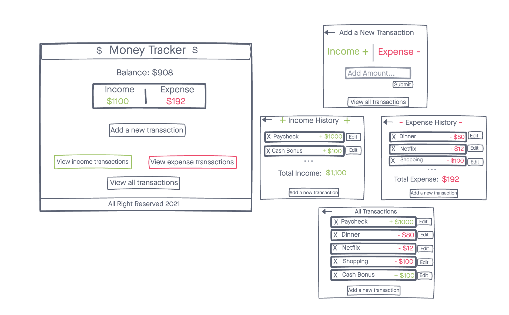

# Money Tracker

I have built an App for an easy way to track both your income and expenses. It serves as a great way to have all your finanaces in once place where you can manage it daily

## Technologies Used
- HTML5
- CSS3
- JavaScript
- React
- Express
- Node.js
- Mongoose
- MongoDB

## Screenshots

## Getting Started
[Click here](https://project-three-frontend.netlify.app/) to get started

## Unsolved Problems
- The main unsolved problem is the total balance for both your incpme and expenses

## Future Enhancements
- Work in progress: Adding a balance total to the top of the page and totals of expenses and income on the respective pages
- Include a way to have the user log in
- Incorporate an "edit" button to be able to change the amount of the transaction
